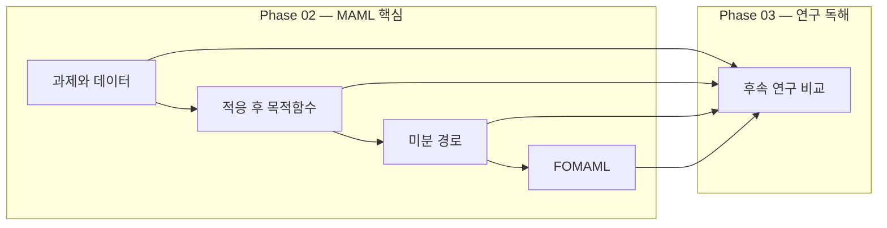

# Concept Map

화살표 A → B는 B의 requires에 A가 있다는 뜻이다. 상태는 각 concept frontmatter만 따른다.

## Reading Order

task-episode → adaptation-objective → meta-gradient → first-order-approximation → research-transfer

## Boundaries

- 표본 분리 vs 과제 분리: 같은 task의 support/query 분리와 meta-train/test task 분리는 서로 다른 평가 경계다.
- 현재 평균 손실 vs 적응 후 손실: 어떤 파라미터에서 어떤 데이터로 평가하는지 구분한다.
- query gradient vs meta-gradient: 미분 변수와 적응 결과의 초기값 의존성을 추적한다.
- HVP vs dense Hessian: 2차 미분 비용을 Hessian 전체를 저장한다는 뜻으로 단정하지 않는다.
- first-order 근사 vs 적응 생략: 무엇을 계산하고 무엇을 미분에서 생략하는지 분리한다.
- 방법 사실 vs 성능 해석: 논문 식·알고리즘과 실험 범위를 각각 인용한다.
- 다른 subject의 미분·선형대수 숙련도는 여기서 상속하지 않는다. 진단 실패 시 필요한 배경만 보완할 범위를 제안한다.

초기화에서는 Definition·Claims를 비워 두고 기준만 준비했다. 각 도입 unit에서 학습자가 Definition을 작성하고 Claims에는 근거 라벨과 자료의 정확한 절·식 포인터를 붙인다. 기준은 U2에서 학습자와 검토한다.
