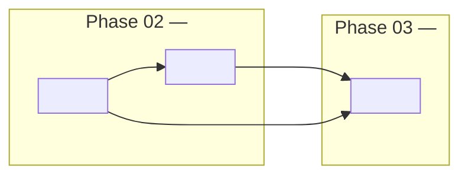

# Concept Map

<!--
개념 사이의 선행 관계(requires). 각 concept 파일의 frontmatter `requires`와 일치해야 한다 — 어긋나면 frontmatter가 기준이다.
화살표는 "A --> B: B를 배우려면 A가 먼저". 초기화 시 목표에서 역방향으로 5–15개를 뽑아 그리고, 개념을 추가·삭제할 때 갱신한다.
Phase 경계는 subgraph로 표시한다. 상태는 여기에 적지 않는다 (concept frontmatter가 기준, `scripts/study-start.sh`가 요약).
-->

## Reading Order

<!-- 위상 정렬 한 줄. Phase PLAN의 unit 순서가 이를 따른다. -->

<concept-a> → <concept-b> → <concept-c>

## Boundaries

<!-- 혼동하기 쉬운 개념 쌍과 그 경계. 각 concept의 Connections(contrasts with)과 일치. -->

- <concept-a> vs <concept-x>: <경계 한 줄>
